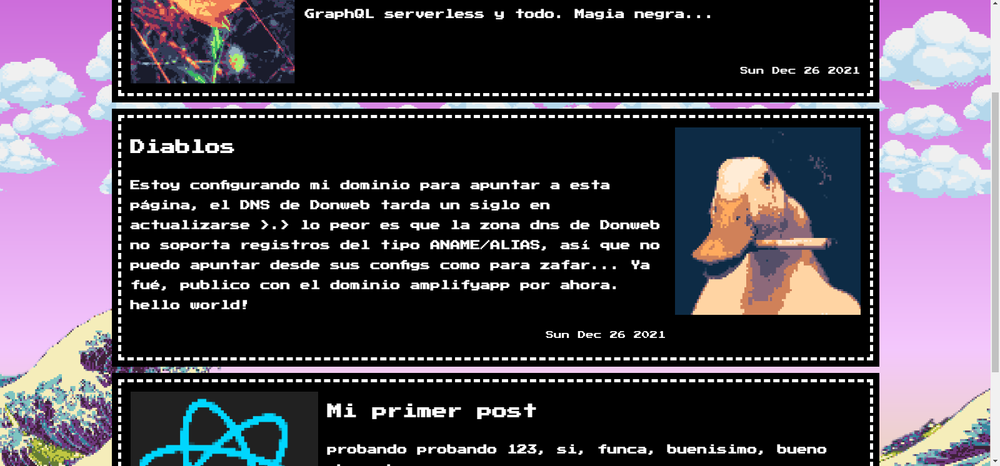

# Blog
## [See it with your own eyes](https://main.d1a6b867byxibv.amplifyapp.com)

### My domain config is taking forever to propagate, I'm stuck with amplify's domain for now

---
Making my own blog, so I can own my data and display it the way I want, only where and when I want :]

Using AWS Free tier with AWS Amplify

**Frontend**: React typescript, Amplify SDK (sort of?) and abstracting around its generated code

**Backend**: AWS Appsync GraphQL wrapper for Dynamodb

# Screenshots

